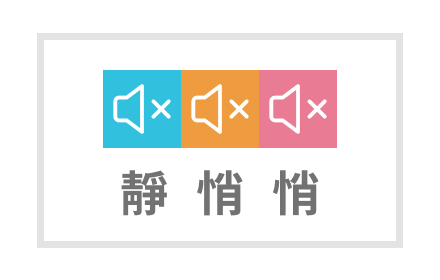

# ani-auto-skip-extension 閉嘴動畫瘋



An extension to mute and wait for animation crazy's ADs  
自動靜音並點及跳過廣告按鈕

https://chromewebstore.google.com/detail/%E5%8B%95%E7%95%AB%E7%98%8B%E9%96%89%E5%98%B4/kdipgoiohdigddmlpmohjdjfogmmmjfi

## Description

This extension will:  
這個擴充功能會：

- Replace disagree Button with addon button
  更換『不同意』按鈕成『啟動自動跳過模式』按鈕
- Mute the tab and show an un-mute button on top of the page  
  靜音瀏覽器分頁並加上一個『取消靜音』的按鈕在網頁上方
- Try skip AD inside Google ADs  
  嘗試略過 Google AD 的廣告 (Skip AD)
- After 30 seconds, try click those skip ad buttons  
  三十秒後嘗試點擊跳過廣告的按鈕
- Restore the volume and stop video from playing  
  恢復頁面聲音並且暫停播放

## Settings 設定

Click the extension icon to open the settings popup:  
點擊擴充功能圖示打開設定：

- 自動靜音廣告 / Mute the tab while ads play
- 跳過後暫停影片 / Pause the anime after skipping
- 強制跳過等待秒數 / Seconds to wait before force-skip (default 30)
- 廣告結束提示音 / Chime when ads are done
- 動畫播畢提示音 / Chime when the episode ends
- 提示音音量 / Chime volume (with test button)
- 桌面通知 / Desktop notification when done

## Installation

This is a [Vite](https://vitejs.dev/) + [@crxjs/vite-plugin](https://crxjs.dev/) project. Source lives in `/src`; it's built into `/dist`, which is what Chrome loads.  
這是一個使用 Vite + @crxjs/vite-plugin 建置的專案，原始碼在 `/src`，建置後輸出到 `/dist`，Chrome 載入的是 `/dist`。

```bash
npm install
npm run build   # one-off build into /dist
# or
npm run dev     # watches src/ and auto-reloads the loaded extension
```

Load unpacked development package > choose the `/dist` directory  
在開發者人員模式中載入未封裝的擴充功能，並選擇 `/dist` 資料夾

While `npm run dev` is running, crxjs handles reloading the extension for you when files under `src/` change — no need to remove `/dist` or manually reload in `chrome://extensions`.

## AD Skip Coverage

- [x] 基本款 無聲內嵌 AD
- [x] 滿版 Google AD, 右下角有五秒後才能跳過的透明黑色按鈕
- [x] 滿版 Google AD, 白色背景，右上角有 XX 秒後可獲得獎勵的按鈕，可以直接跳過
- [ ] 半版彈出式小型 Google AD (出現機率感人，可用的 selector 未知)

## Support

No guarantee. Raise some issues and I will eventually see them, and probably ignore them.
